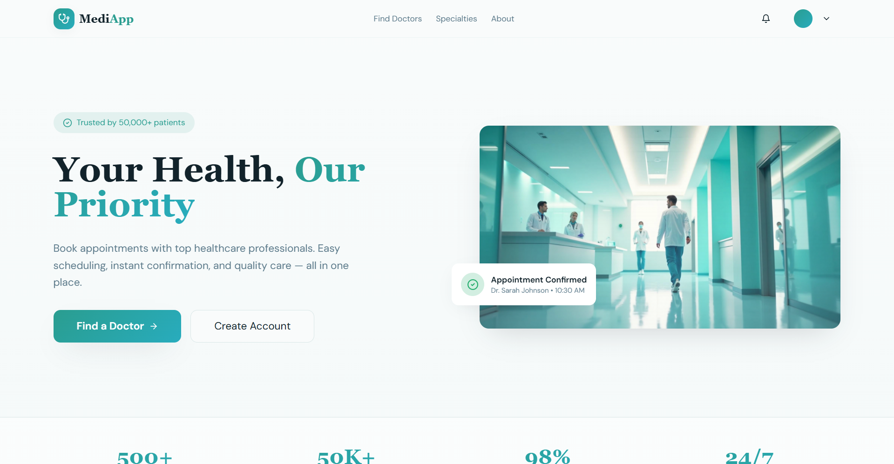

# MediApp Frontend — React + Vite

This repository contains the frontend application for the MediApp medical appointment booking system. It is implemented with React + Vite and provides the UI for patients to search doctors, view availability, and book appointments. The backend microservices are part of the separate backend repository — see the "Backend" section below.

## Tech Summary (frontend)

- Framework: React (Vite)
- Language: TypeScript
- UI: shadcn-ui + Tailwind CSS
- Dev server: Vite

Contributors:

- Youssef Ben Salem
- Seifeddine Boudoukhane

## Local Setup (frontend only)

Prerequisites:

- Node.js (recommend LTS) and `npm`
- Access to the running backend Gateway (or local mock) — Gateway base URL used by the frontend is set via `VITE_GATEWAY_URL`

Quick start:

```bash
# install deps
npm install

# run dev server
npm run dev
```

Environment variables:

- Create a `.env` file in the frontend root (same folder as this `README.md`). Example:

```
VITE_GATEWAY_URL=http://localhost:8550
```

Restart the dev server after changing env vars.

## Backend (where to run the API and microservices)

This repository is frontend-only. To run the backend microservices (Gateway, Security, User, Doctor, Booking, Notification, Discovery), see the Backend repository:

- Backend repo: https://github.com/jozefelmanga/MediApp-Backend

The frontend expects the Gateway to expose `/api/v1/*` endpoints and to accept `Authorization: Bearer <token>` for protected routes.

## Postman collection

Import the Postman collection from the Backend repo to test APIs end-to-end:

- `postman/MediApp_Gateway_Collection.json` in https://github.com/jozefelmanga/MediApp-Backend

The collection contains ready-to-run workflows and sets variables such as `access_token`, `patient_id`, `doctor_id`, and `appointment_id` during runs.

## Screenshots





